# Architecture & Flow Diagrams — Kinko Backoffice Frontend

> Generated: 2026-05-09  
> Diagrams use [Mermaid](https://mermaid.js.org/) syntax — render in GitHub, VS Code (Markdown Preview), or mermaid.live

---

## Table of Contents

1. [System Architecture Overview](#1-system-architecture-overview)
2. [Frontend Layers](#2-frontend-layers)
3. [Route & Guard Flow](#3-route--guard-flow)
4. [Super Admin Login Flow](#4-super-admin-login-flow)
5. [Regular User Login Flow](#5-regular-user-login-flow)
6. [Forgot Password Flow](#6-forgot-password-flow)
7. [Invite Accept Flow](#7-invite-accept-flow)
8. [Token Refresh Interceptor Flow](#8-token-refresh-interceptor-flow)
9. [Organisation Context Resolution](#9-organisation-context-resolution)
10. [Org Switch Flow](#10-org-switch-flow)
11. [Super Admin Dashboard — Tab Build Flow](#11-super-admin-dashboard--tab-build-flow)
12. [RBAC — Permission Check Flow](#12-rbac--permission-check-flow)
13. [Redux Data Fetch — Deduplication Pattern](#13-redux-data-fetch--deduplication-pattern)
14. [Bulk Upload Lifecycle](#14-bulk-upload-lifecycle)
15. [Bulk Upload Row Status Machine](#15-bulk-upload-row-status-machine)
16. [Verification Portal — State Machine](#16-verification-portal--state-machine)
17. [Verification Portal — Full Sequence](#17-verification-portal--full-sequence)
18. [API Request Lifecycle](#18-api-request-lifecycle)
19. [Session & Cookie Lifecycle](#19-session--cookie-lifecycle)
20. [Component Hierarchy](#20-component-hierarchy)

---

## 1. System Architecture Overview

```mermaid
graph TB
    subgraph Browser["Browser (HashRouter)"]
        direction TB
        SA[SuperAdminLogin<br/>#/admin/login]
        UL[UserLogin<br/>#/login]
        SAD[SuperAdminDashboard<br/>#/admin/dashboard]
        RD[RoleDashboard<br/>#/dashboard]
        VP[VerifyPortal<br/>#/verify?token=...]
        IA[InviteAccept<br/>#/invite/accept]
    end

    subgraph State["State Layer"]
        AC[AppContext<br/>currentUser · activeOrg · isSuperAdmin]
        RX[Redux Store<br/>login · me · orgs · roles · users]
    end

    subgraph HTTP["HTTP Layer"]
        AX[AxiosUtils<br/>withCredentials · X-ORG-ID · refresh interceptor]
        AN[AnonAxios<br/>no auth · no X-ORG-ID]
    end

    subgraph Proxy["Vite Dev Proxy"]
        PR[/api/v1/* → http://10.0.21.159:8008/*]
    end

    subgraph Backend["Backend API (Spring Boot :8008)"]
        AUTH[/auth/*<br/>Cookie auth]
        CMSU[/cms-users/*<br/>Backoffice operators]
        ORGS[/orgs/*<br/>Organisations]
        ROLES[/roles · /permissions<br/>RBAC]
        ME[/me/permissions<br/>Effective permissions]
        BULK[/bulk/*<br/>CSV upload jobs]
        VERI[/verify/*<br/>Public enrolment portal]
        USERS[/users/*<br/>Consumer profiles]
    end

    SA & UL -->|loginAsync Redux| RX
    RX -->|setSessionFromApi| AC
    SAD & RD -->|read| AC
    SAD & RD -->|dispatch thunks| RX
    VP -->|anonymous calls| AN
    IA -->|auth calls| AX

    RX -->|services/*.js| AX
    AX -->|proxy| PR
    AN -->|direct| PR
    PR --> AUTH & CMSU & ORGS & ROLES & ME & BULK & VERI & USERS
```

---

## 2. Frontend Layers

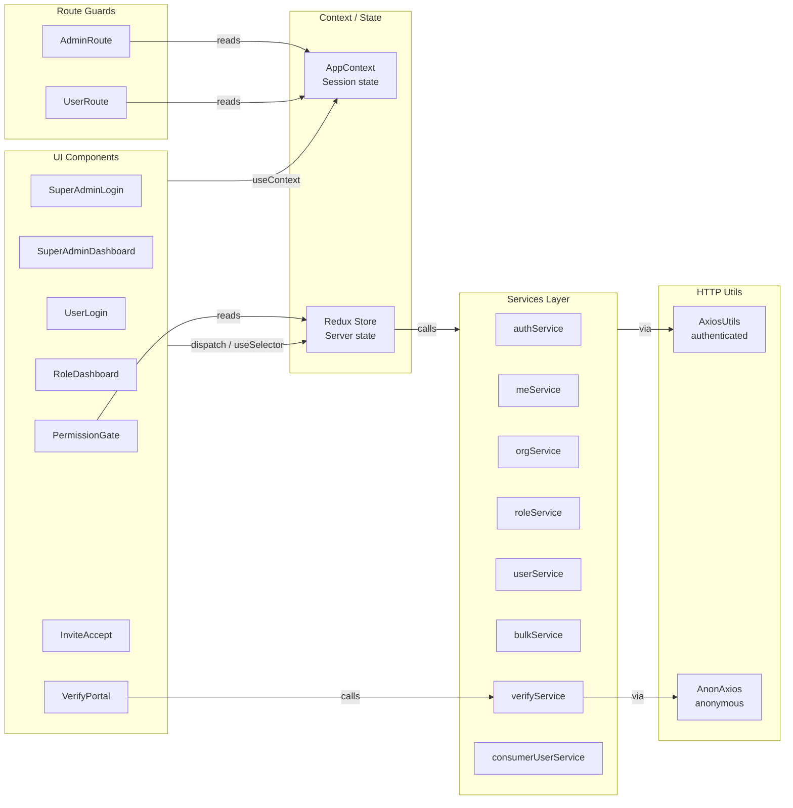

---

## 3. Route & Guard Flow

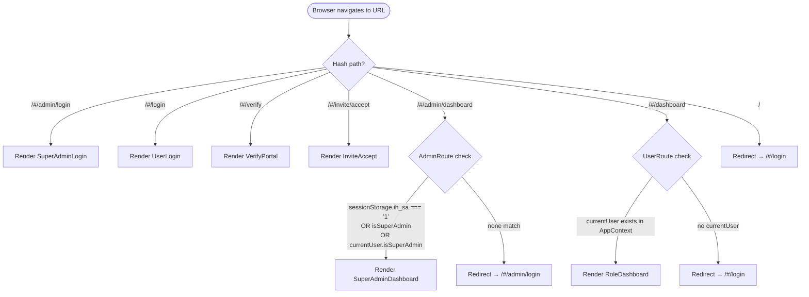

---

## 4. Super Admin Login Flow

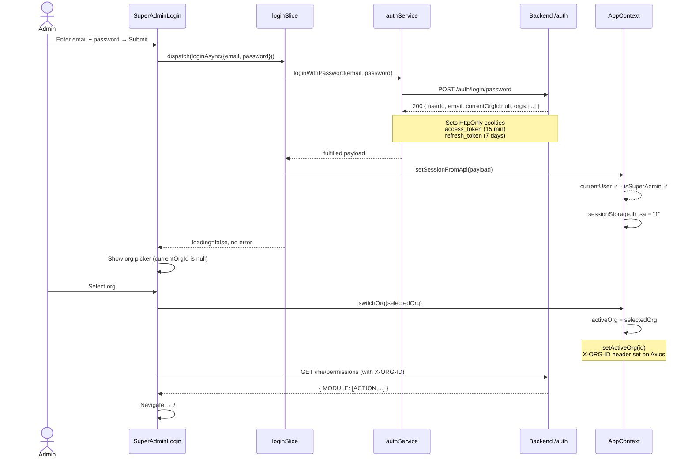

---

## 5. Regular User Login Flow

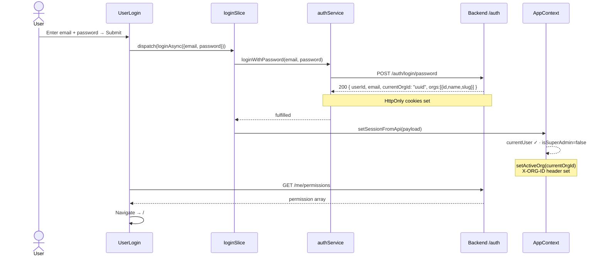

---

## 6. Forgot Password Flow

```mermaid
flowchart TD
    A([View: login]) -->|Click 'Forgot password'| B([View: forgot])
    B -->|Enter email → Submit| C[POST /auth/otp/send\npurpose: FORGOT_PASSWORD]
    C -->|200 OK| D([View: otp])
    C -->|USER_NOT_FOUND| E[Show error inline]
    E --> B

    D -->|Enter 6-digit OTP → Verify| F[POST /auth/otp/verify\npurpose: FORGOT_PASSWORD]
    F -->|200 + verifyToken| G([View: reset])
    F -->|INVALID_OTP| H[Show 'Incorrect OTP']
    F -->|OTP_EXPIRED| I[Show 'OTP expired'\nReveal Resend button]
    F -->|OTP_INVALIDATED| J[Show 'Too many attempts'\nBack to forgot view]
    H --> D
    I --> D
    J --> B

    G -->|Enter new password → Submit| K[POST /auth/reset-password\n{ verifyToken, newPassword }]
    K -->|200 OK| L([View: done])
    K -->|INVALID_VERIFY_TOKEN| M[Show 'Link expired'\nRestart flow]
    M --> B
    L -->|Click 'Back to login'| A
```

---

## 7. Invite Accept Flow

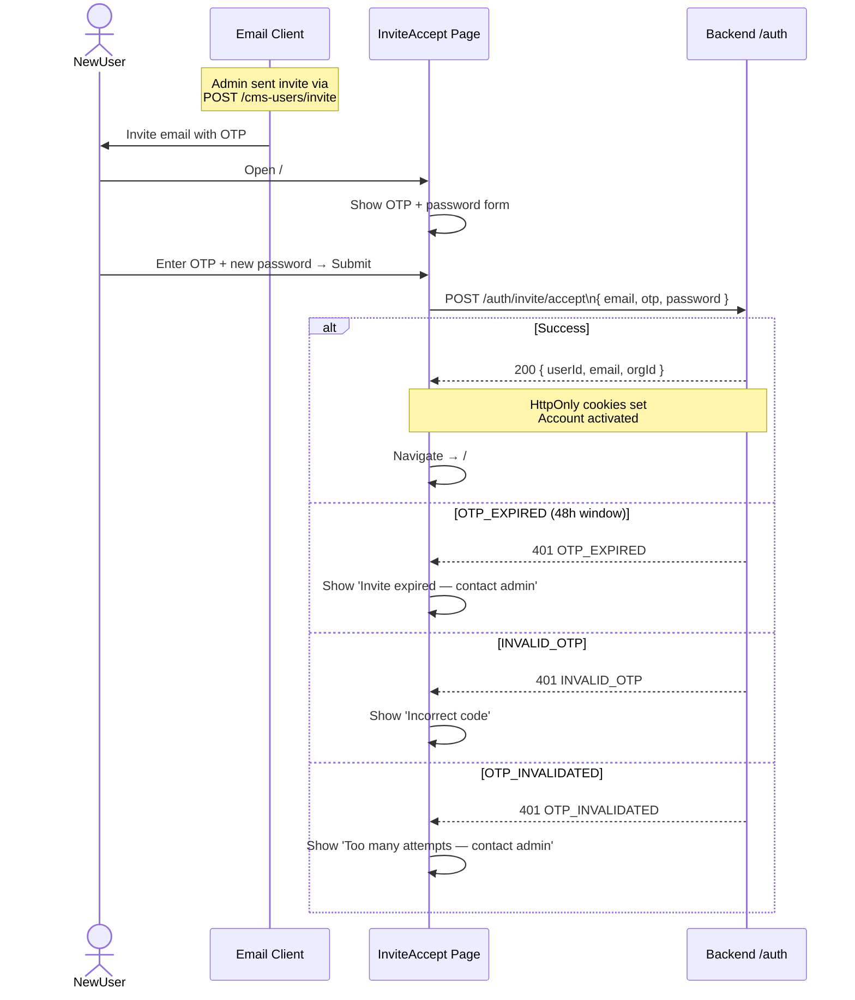

---

## 8. Token Refresh Interceptor Flow

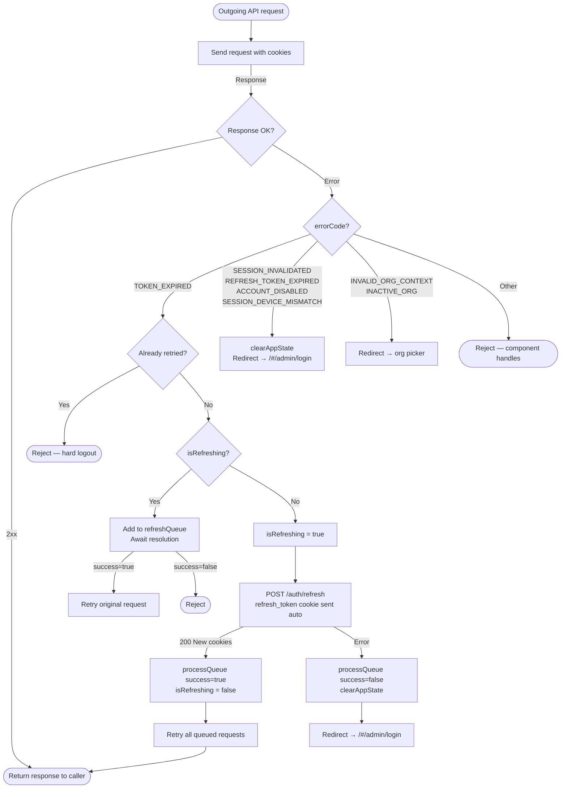

---

## 9. Organisation Context Resolution

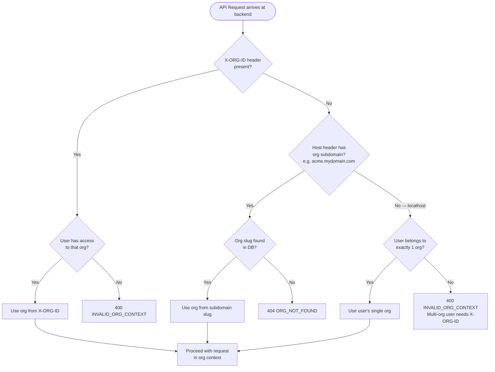

---

## 10. Org Switch Flow

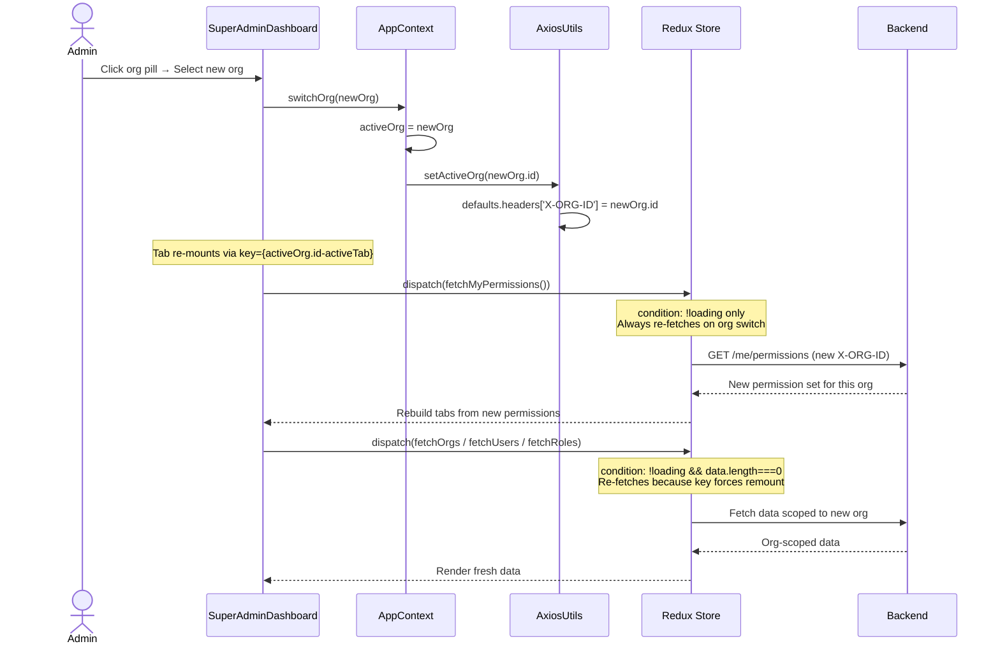

---

## 11. Super Admin Dashboard — Tab Build Flow

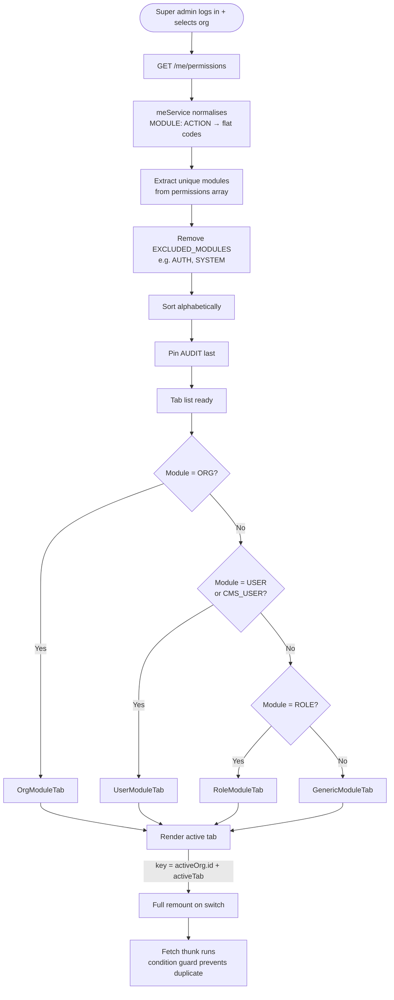

---

## 12. RBAC — Permission Check Flow

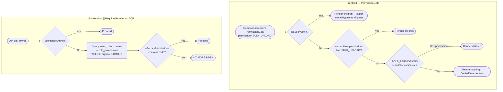

---

## 13. Redux Data Fetch — Deduplication Pattern

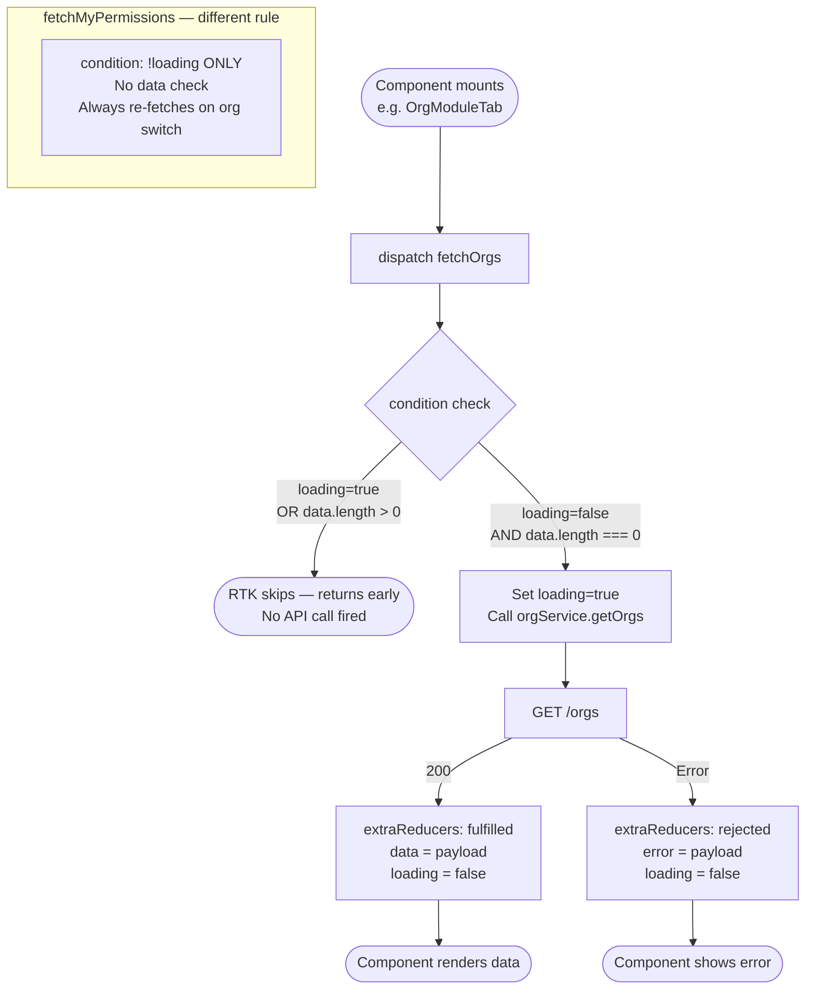

---

## 14. Bulk Upload Lifecycle

```mermaid
flowchart TD
    START([Admin uploads CSV]) --> UP[POST /bulk/upload\nmultipart/form-data]
    UP --> ACCEPT[202 Accepted\njob.status = PENDING]
    ACCEPT --> POLL{Poll GET /bulk/id\nevery 1-2s}
    POLL -->|status = PROCESSING| POLL
    POLL -->|status = FAILED| FAIL([Show parse error\nno rows created])
    POLL -->|status = COMPLETED| REVIEW

    subgraph REVIEW["Admin Review Phase (DRAFT)"]
        REVIEW([Rows in DRAFT\nno emails sent yet])
        REVIEW --> OPT{Admin action?}
        OPT -->|Edit a row| EDIT[PUT /bulk/id/rows/rowId\nDRAFT rows only]
        OPT -->|Cancel a row| CROW[POST /bulk/id/rows/rowId/cancel]
        OPT -->|Cancel whole job| CJOB[POST /bulk/id/cancel\nAll rows → CANCELLED]
        OPT -->|Ready to send| DISPATCH
        EDIT --> REVIEW
        CROW --> REVIEW
        CJOB --> CANCELLED([Job CANCELLED])
    end

    DISPATCH[POST /bulk/id/dispatch\nDRAFT rows → STAGED\nInvite emails sent]
    DISPATCH --> MONITOR

    subgraph MONITOR["Monitoring Phase"]
        MONITOR([Monitor rows])
        MONITOR --> ROWACT{Per-row action?}
        ROWACT -->|Resend invite| RESEND[POST /bulk/id/rows/rowId/resend-invite\n60s cooldown · max 5 sends]
        ROWACT -->|Cancel row| CROW2[POST /bulk/id/rows/rowId/cancel]
        ROWACT -->|Consumer verifies| VFLOW[Verify Portal flow]
        VFLOW --> PROMOTED[Row → PROMOTED\nconsumer profile created]
        PROMOTED --> DONE
    end

    DONE([Job phase = COMPLETED\nAll rows in terminal states])
```

---

## 15. Bulk Upload Row Status Machine

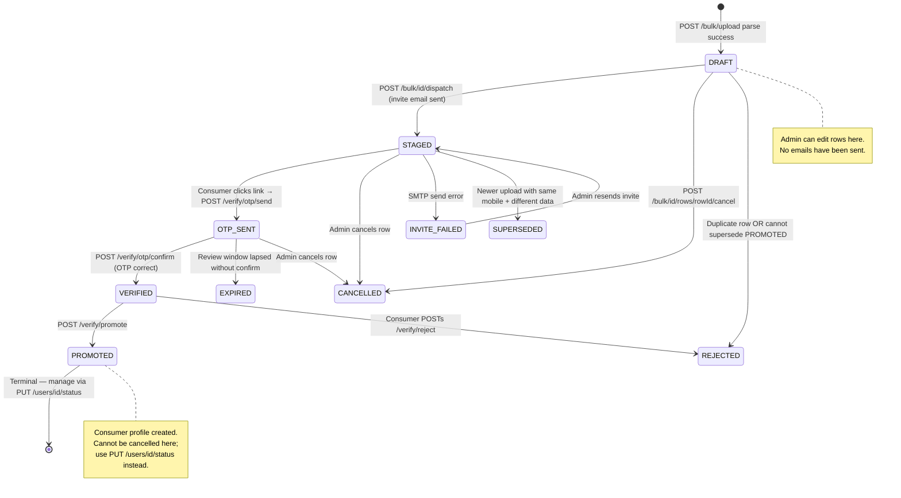

---

## 16. Verification Portal — State Machine

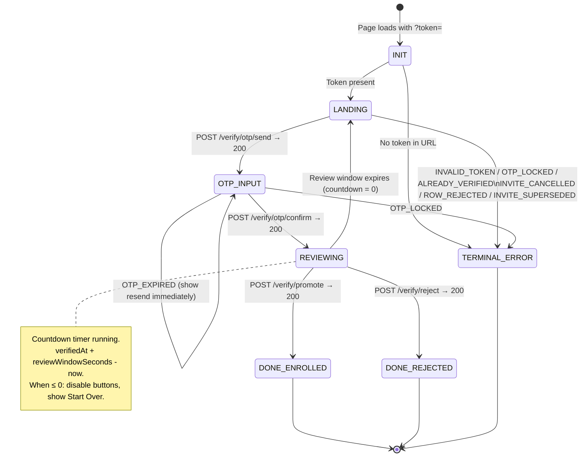

---

## 17. Verification Portal — Full Sequence

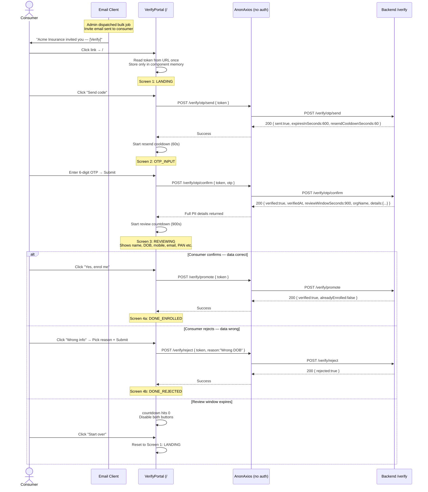

---

## 18. API Request Lifecycle

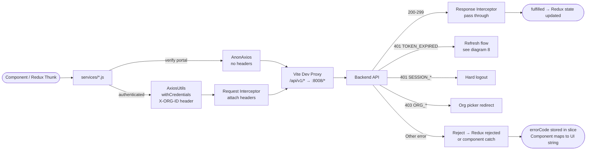

---

## 19. Session & Cookie Lifecycle

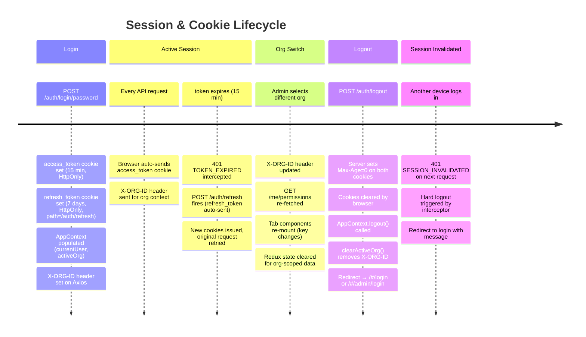

---

## 20. Component Hierarchy

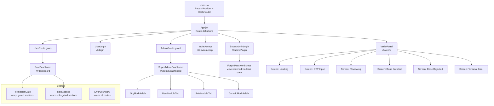

---

*End of ARCHITECTURE.md*
